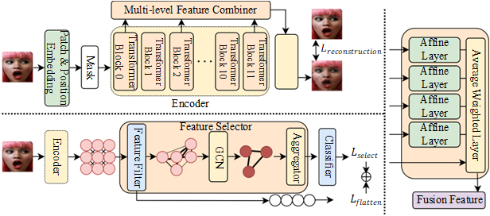

## MFS: Self-Supervised Facial Expression Recognition with Fine-grained Feature Selection


This is a PyTorch implementation of the paper *"MFS: Self-Supervised Facial Expression Recognition with Fine-grained Feature Selection."* The overall framework is shown in the Figure above.

### Training

**First, you need to execute the pre-training with multi-level feature fusion**:

```
python main_pretrain.py \
--data <path to your dataset> \
--outputdir <path to your checkpoints> \
--other parameters for pre-training
```

**Subsequently, fine-tune with the assistance of the fine-grained feature selector:**

```
python main_finetune.py \
--data <path to your dataset> \
--outputdir <path to your checkpoints> \
--nb_classes <number of the classes>\
--other parameters for pre-training
```

**If you want to attempt pre-training under more difficult task, use the fine-tuned model as a teacher model to guide the generation of masks:**

```
python main_pretrain_with_difficulty.py \
--data <path to your dataset> \
--outputdir <path to your checkpoints> \
--teacher_model <path to the fine-tuned model> \
--mask_strategy <can be random or attention> \
--mask_ratio <ratio of the masked patches> \
--clue_ratio <ratio of the reserved patches>


```


